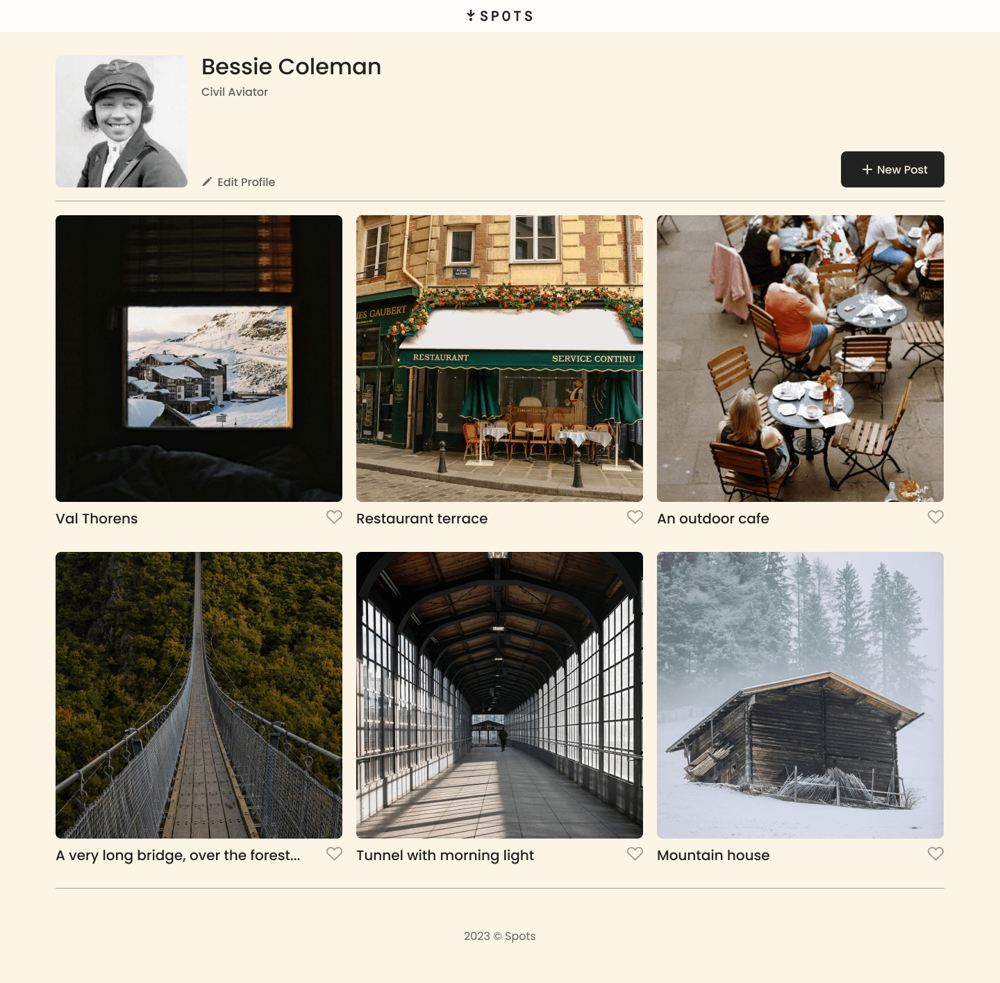
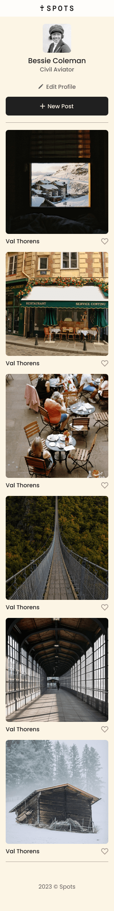

# Project 3: Spots

### Overview

- Description
- Tech Stack
- Screenshots
- Deployment

**Description**

This is Spots. A Software Engineering project based on media sharing websites. This was made for the Sprint 3, Sprint 4, and Sprint 5's project on TripleTen. I spent roughly two days on the whole project and it allowed me to learn the ins and outs of adaptive web design and media queries in CSS.

**Tech Stack**

- HTML

- CSS

- Adaptive Web Design

**Images**  
 

**Deployment**

You can view the project on GitHub Pages using the link below:
https://f0xyw4ffl3z.github.io/se_project_spots/index.html

Video overview:
https://drive.google.com/file/d/14IWCtMaBBS2ngFR-nhtoVTvGivEcvXCx/view?usp=drive_link

Enjoy the project!
